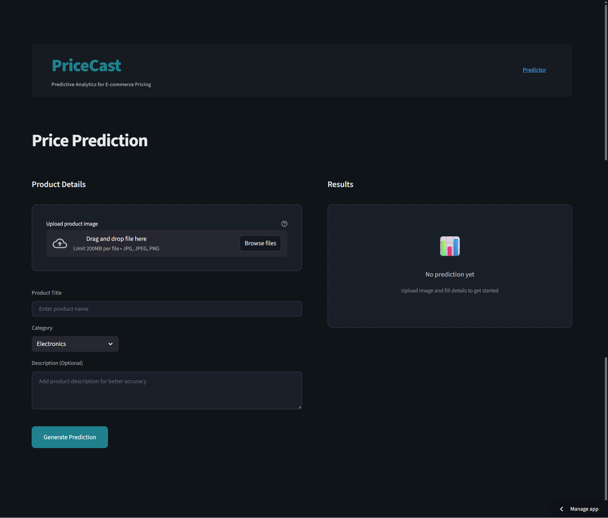

# PriceCast---Predictive-Analytics-for-E-commerce-Pricing
---

  

A **multimodal machine learning pipeline** built for the **Amazon ML Challenge**, predicting product prices using **text**, **image**, and **tabular** features.  
This end-to-end solution combines **Sentence-BERT**, **CLIP embeddings**, and **engineered numerical signals**, trained through a **5-fold ensemble of MLP and Ridge regressors**.

---

## 🚀 Key Highlights

-  **Text modeling** using Sentence-BERT and TF-IDF + SVD  
-  **Image features** via OpenAI CLIP / open-clip-torch  
-  **Tabular engineering** for size, brand, and packaging cues  
-  **Dimensionality reduction** with PCA for text/image embeddings  
-  **Model stack:** MLP + Ridge ensemble  
-  **Evaluation metric:** 50-SMAPE (aligned with leaderboard setup)  
-  **Caching:** PCA/scaler artifacts for reproducible runs  
-  **Cross-validation:** 5-fold CV on log-prices with blending  

---

##   Methodology

### 1. **Text Channel**
- Extract text from product titles and descriptions  
- Generate embeddings via **Sentence-BERT (SBERT)**  
- Compute **TF-IDF bigram vectors**, reduced with **TruncatedSVD (128 components)**  
- Apply **PCA (128D)** to SBERT embeddings and cache models

### 2. **Image Channel**
- Load product images from `/images/`  
- Extract **CLIP image embeddings** (OpenAI CLIP / open-clip-torch)  
- Reduce to **128 dimensions** using PCA

### 3. **Tabular Features**
- Regex-based signals for:
  - `pack_count`, `size_val`, `norm_qty`, `total_qty`
  - Brand frequency encoding (`brand_freq`, `brand_te`)
  - Logical indicators (`has_pack`, `has_qty`, `log_total_qty`)
- Feature scaling via `StandardScaler`

### 4. **Modeling & Ensembling**
- Concatenate `[SBERT_PCA | CLIP_PCA | TF-IDF_SVD | Tabular]`  
- Apply log1p transformation and winsorize targets (0.5–99.5%)  
- Train **5-fold MLPRegressor + Ridge** models  
- Blend predictions from both models  
- Evaluate using **50-SMAPE metric**

---
🧭 Roadmap

🔁 Try different SBERT & CLIP backbones

📉 Tune PCA dimensionality per modality

🧮 Add LightGBM / CatBoost stacking

💾 Implement model checkpointing for long sessions

🧰 Integrate experiment tracking (Weights & Biases or MLflow)

